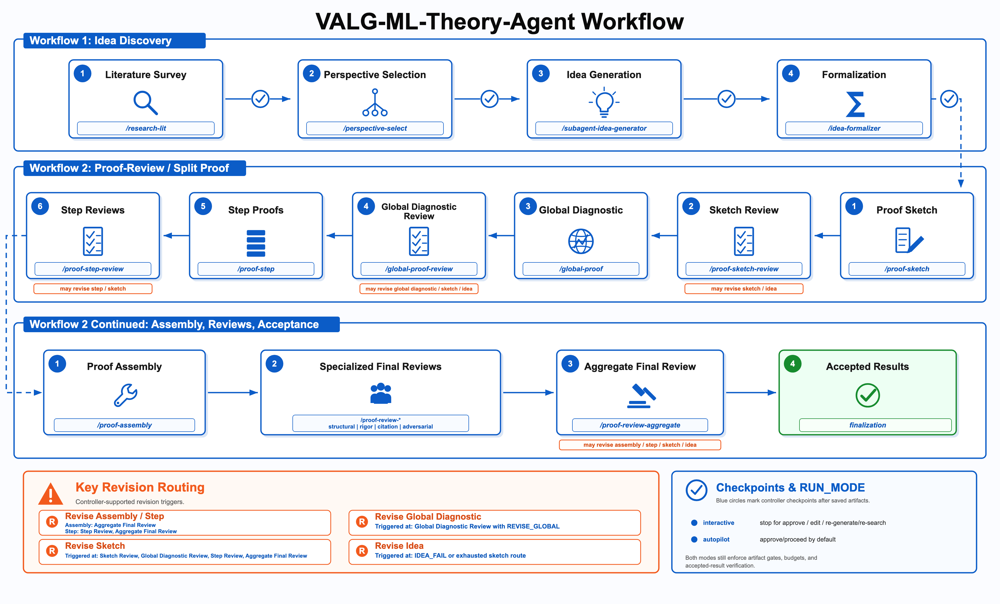
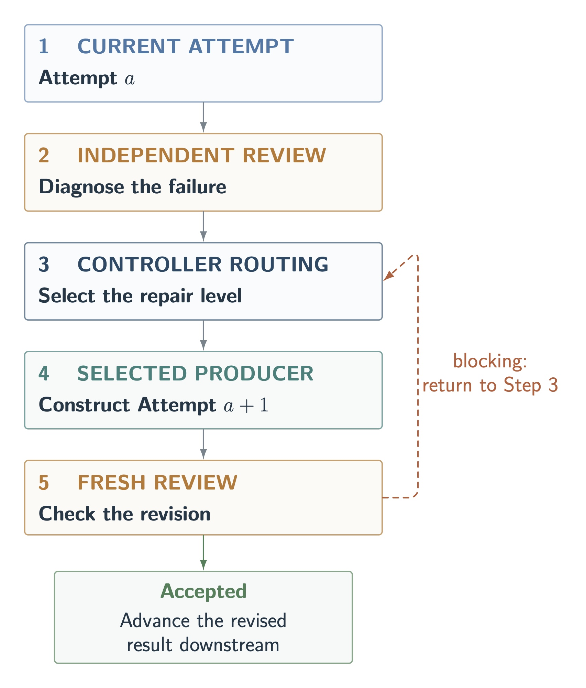

# VALG: An Agentic System for ML Theory Research

<div align="center">

   [](LICENSE)

[🚀 Quick Start](#quick-start) | [🔥 Why It Matters](#why-valg-ml-theory-agent) | [⚙️ Workflow](#how-valg-ml-theory-agent-works) | [🧪 Case Studies](#colt-2026-case-studies) | [📚 Documentation](#documentation) | [📝 Citation](#citation)

</div>

**VALG-ML-Theory-Agent** is an artifact-driven Codex workflow for developing
theorem candidates in machine-learning theory. It treats the
problem setup, theorem formulation, and proof as objects that may need to
co-evolve, while keeping every revision tied to the originating research
question.

Starting from a source problem, the workflow maps the literature, launches
distinct perspective branches, formalizes viable ideas into fixed settings and
goals that serve as theorem contracts, develops proofs from global structure to
local derivations, and routes failures to the smallest stage capable of
repairing them. When a failure exposes an obstruction in the theorem
formulation rather than a local derivation or proof structure, it creates an
explicitly related variant or relaxation, allowing the problem setup to be
revised while preserving its mathematical relationship to the source problem.
A run may return zero, one, or several workflow-accepted theorem candidates.

<p align="center">
  🔥 <strong>Source-relative refinement</strong> ·
  🔍 <strong>Multi-level verification</strong> ·
  🧩 <strong>Graph-structured proofs</strong> ·
  📦 <strong>Auditable artifacts</strong>
</p>

<p align="center">
  <a href="assets/workflow.png"></a>
</p>
<p align="center"><em>Workflow 1 creates source-relative theorem branches. Workflow 2 develops and reviews every active branch from proof graph to accepted manuscript, with failure-localized repair routing throughout.</em></p>

## Quick Start

Prerequisites: a local checkout of this repository and Codex with personal
skills enabled and support for subagents.

### 1. Install the complete skill bundle

From the root of a local checkout, copy the complete bundle into your personal
Codex skill directory:

```bash
mkdir -p ~/.codex/skills
cp -R skills/. ~/.codex/skills/
```

Keep `_shared/` beside the 17 skill directories. It contains the templates,
artifact contracts, and checklists used across the workflow.

### 2. Create a run root

```bash
mkdir -p /path/to/research-project/runs/my-problem
cd /path/to/research-project/runs/my-problem
```

Add a `RESEARCH_BRIEF.md` when you have a clear or partially clear working
direction that should remain stable across the run. Start from the reusable
[minimal brief](examples/minimal/RESEARCH_BRIEF.md).

### 3. Invoke the controller

Open Codex in the run root and send:

```text
$ml-theory-research-agent "your ML theory research direction"
```

> [!TIP]
> **Make the target explicit.** A prompt-only run is supported: the controller
> uses the prompt as the effective research direction. When
> `RESEARCH_BRIEF.md` is present, the controller merges it with the prompt
> before literature search, with the brief refining or overriding overlapping
> details. Literature mapping, perspective selection, idea generation, and
> formalization therefore share one stable, inspectable target.

A useful brief can state the source question; model, data, learner, oracle, or
algorithmic setting; desired theorem or form of progress; assumptions and
constraints; known obstacles; excluded shortcuts; and criteria for full,
partial, conditional, or negative progress. It need not begin with a complete
formal statement: record the choices that are already clear and identify those
that remain open to refinement. See the [minimal brief](examples/minimal/RESEARCH_BRIEF.md)
for a concise template and the [COLT 2026 case studies](case-studies/colt-2026/README.md)
for detailed, source-grounded examples.

`RUN_MODE=interactive` is the default. To approve research checkpoints by
default while retaining source-fidelity, artifact, provenance, retry-budget,
and final-review gates, include `RUN_MODE=autopilot`.

Accepted branches are copied to:

```text
results/perspective_M/idea_N/theory/
```

For the project-local installation alternative and a detailed first-run
walkthrough, see [Getting Started](docs/getting-started.md).

## Why VALG-ML-Theory-Agent

ML-theory questions rarely begin as fully specified formal statements. The data
model, learner, oracle, randomness, loss, regime, and target guarantee may all
need refinement while a useful theorem is being discovered. The `VALG` prefix
in **VALG-ML-Theory-Agent** denotes multi-level **V**erification, **A**daptive
formulation of **L**earning-theory problems, and **G**raph-structured proof
development. The workflow makes this refinement explicit, allowing the problem
setup to evolve through source-relative variants while preserving each theorem
branch's mathematical relationship to the originating question.

<details>
<summary><strong>The initials also honor four pioneers of learning theory</strong></summary>

The name recognizes Leslie **V**aliant, whose [PAC framework](https://doi.org/10.1145/1968.1972) formalized efficient learnability; Dana **A**ngluin, whose [`L*` algorithm](https://doi.org/10.1016/0890-5401(87)90052-6) established polynomial-time exact learning of regular languages from membership and equivalence queries; Nick **L**ittlestone, whose [mistake-bound analysis and Winnow algorithm](https://doi.org/10.1007/BF00116827) shaped online learning; and E. Mark **G**old, whose [identification-in-the-limit framework](https://doi.org/10.1016/S0019-9958(67)91165-5) provided an early mathematical model of language learning.

</details>

## How VALG-ML-Theory-Agent Works

The public `ml-theory-research-agent` skill is the controller. It owns stage
order, checkpoints, worker provenance, retry budgets, branch routing, history,
and accepted-result copying. Specialized producer and reviewer skills own the
research or verification rubric for one artifact.

```text
research direction + optional RESEARCH_BRIEF.md
                         |
                         v
           Workflow 1: pre-proof research
 literature -> perspectives -> ideas -> formal theorem contracts
                         |
                         v
             Workflow 2: proof and review
 sketch -> global diagnostic -> steps -> assembly -> final reviews
                         |
                         v
       accepted candidate or smallest-target repair
```

### Workflow 1: Pre-Proof / Idea Discovery

Workflow 1 treats problem formulation as research, not as an invisible
prerequisite to proof search.

| Stage | Main responsibility | Gate |
| --- | --- | --- |
| **Direction merge** | Merge the prompt with an optional `RESEARCH_BRIEF.md`, with the brief taking priority where they overlap. | Preserve explicit and clearly implied source constraints downstream. |
| **Literature survey** | Separate direct theory, foundational frameworks, and relevant empirical evidence; map settings, results, techniques, testbeds, and evidence-supported gaps. | Check source fidelity and the value of the proposed gaps. |
| **Perspective selection** | Launch a small set of distinct, literature-grounded research lenses across analysis target, model class, data assumptions, regime, and algorithm. | Reject perspectives that are redundant, unsupported, or inconsistent with the source direction. |
| **Idea generation** | Develop a mechanism-level candidate within each perspective. An idea may specialize its perspective, but may not silently broaden or contradict it. | Reject unsupported ideas and duplicates across active perspective branches. |
| **Formalization** | Fix notation, primitive assumptions with stable identifiers, quantifiers, regime, and exactly one mathematical goal. | The accepted `setting.md` becomes the binding theorem contract for proof work. |

Approved perspectives remain separate branches. The controller initializes all
approved branches before concentrating proof work on any one branch, then
advances them in parallel when the runtime supports it or by fair round-robin
scheduling otherwise. It continues the remaining branches after one succeeds
unless the user explicitly requests a first-success search. An idea worker may
also return `NO_VIABLE_IDEA` instead of manufacturing a weak candidate.

### Workflow 2: Proof-Review / Split Proof

Workflow 2 starts only after a branch has a checked, fixed theorem contract. It
separates theorem architecture, theorem-level feasibility, local derivations,
and final exposition so each can be reviewed at the level where its defects
arise.

| Phase | Producer work | Reviewer gate |
| --- | --- | --- |
| **Proof sketch** | Represent the argument as a directed acyclic graph: assumptions are source nodes, lemma-sized claims are internal nodes, and the target theorem is the unique sink. Record exact claims, dependencies, allowed assumptions, proof tools, blockers, and required output interfaces. | Check exact-goal fidelity, dependency legality, mechanism witnesses, provenance, closure, and interface feasibility before detailed proof work. |
| **Global diagnostic** | Expand the accepted graph into a whole-theorem analysis. Trace each hard claim to a mechanism or cited result and test quantitative strength, object compatibility, probability modes, closure arguments, baseline behavior, and downstream composability. | Distinguish a diagnostic rewrite from a graph defect or a theorem-contract obstruction. |
| **Step proofs** | Prove each graph obligation in dependency order using only the formal setting and accepted dependencies. Local lemmas must be exposed and proved before deriving the exact assigned claim. | A distinct reviewer audits every local lemma, hidden subclaim, citation use, assumption, boundary case, and final target-step derivation. |
| **Assembly** | Reconcile notation and compose accepted step claims into a self-contained LaTeX theorem manuscript without introducing new mathematics. | Require complete step coverage, a consistent theorem statement, and a paper-ready source bundle. |
| **Specialized final review** | Present the same authoritative setting and proof artifacts to structural, rigor, citation, and adversarial reviewers. | Each reviewer tests a non-substitutable failure surface and reports blocking issues without routing repairs directly. |
| **Aggregate review** | Reconcile the four diagnostic reviews and proof-contract checks into the sole controller-facing verdict. | Report a score, failure type, critical issues, repair target, and retry mode; acceptance requires an internally consistent, blocker-free proof verdict. |

After an aggregate `ACCEPTED` verdict, the controller separately verifies the
artifact, worker-provenance, and attempt-budget gates; copies only the public
bundle; verifies that copy; and only then marks the branch accepted.

> [!NOTE]
> **A consistent proof graph is necessary but not sufficient.** An upstream
> lemma about a surrogate, transformed, or averaged object may fail to deliver
> the exact object or quantitative strength consumed downstream. The global
> diagnostic looks for these cross-step failures before expensive local proof
> work. It guides step workers, but it is diagnostic context rather than proof
> evidence and never replaces accepted step proofs.

### Human Checkpoints and Agent Reviewers

The two workflows use different review authority because they answer different
kinds of questions.

| Stage | Review authority | Why |
| --- | --- | --- |
| **Discovery and formulation** | User/human checkpoints in interactive mode | Whether a gap, perspective, mechanism, or theorem formulation is scientifically valuable is an open-ended research judgment. |
| **Proof and assembly** | Reviewers distinct from the producers | Once the theorem contract is fixed, artifacts can be checked against explicit obligations for goal alignment, assumption fidelity, logical soundness, and derivational rigor. |

Interactive mode supports `approve/proceed`, `edit`, and
`re-generate/re-search` at Workflow 1 checkpoints. Autopilot approves those
checkpoints by default; it does not relax theorem contracts, branch coverage,
producer-reviewer separation, or final acceptance gates.

### Diagnosis and Revision

A failed attempt may expose a defect in a local derivation, a dependency
interface, the proof architecture, the theorem formulation, or the problem
setup itself. VALG-ML-Theory-Agent uses a hierarchy of revision loops that
routes each diagnosis to the smallest stage capable of repairing it:

```text
proof assembly -> proof step -> proof sketch -> idea and formal setting
```

The global diagnostic may be revised under the same proof sketch or may expose
a defect that requires sketch or formulation repair. When the obstruction lies
in the theorem formulation or initial setup, the workflow creates a
source-relative variant or relaxation, preserving its mathematical relationship
to the originating problem.

<p align="center">
  <a href="assets/revision-loops.png"></a>
</p>

The reviewer identifies the smallest mathematical object that must change; the
controller validates the diagnosis, selects the responsible stage, and charges
its retry budget. The selected producer changes only the implicated component
using the accepted upstream context, the failed attempt, and the validated
diagnosis. Every revision must pass a fresh independent review or human
checkpoint before downstream use. If a local retry budget is exhausted, the
controller escalates to the next broader repair level with remaining budget.

## Auditable Outputs

VALG-ML-Theory-Agent leaves a structured research record rather than only a
final manuscript.

| Layer | Representative artifacts | Purpose |
| --- | --- | --- |
| **Run** | `LITERATURE_SURVEY.md`, `Perspective_Selection.md`, `IDEA_REPORT.md`, `theory_tracker.md`, `worker_log.md` | Record source interpretation, active branches, outcomes, and worker provenance. |
| **Branch** | `idea.md`, `setting.md`, `proof_sketch.md`, `global_proof.md`, `proof_steps/`, specialized reviews, `proof_history/` | Preserve the theorem contract, current step-proof evidence, diagnostic artifacts, and non-binding history. |
| **Accepted result** | `setting.md`, `latex_template/`, `proof_review.md` | Expose only the formal setting, assembled theorem manuscript, and aggregate workflow verdict. |

The narrow accepted bundle is intentional. Diagnostic, archival, and
controller-private artifacts remain in the full branch trace but are not copied
as accepted proof evidence. See [Run Layout](docs/run-layout.md) for binding and
non-binding artifact rules and [Configuration](docs/configuration.md) for exact
statuses and attempt budgets.

<details>
<summary><strong>Full 17-skill map</strong></summary>

| Layer | Skills | Responsibility |
| --- | --- | --- |
| **Controller** | `ml-theory-research-agent` | Orchestration, checkpoints, provenance, budgets, routing, history, and finalization |
| **Discovery and formulation** | `research-lit`, `perspective-select`, `subagent-idea-generator`, `idea-formalizer` | Literature gaps, perspective breadth, mechanism-level ideas, and theorem contracts |
| **Proof architecture** | `proof-sketch`, `proof-sketch-review`, `global-proof`, `global-proof-review` | Typed dependency graphs and theorem-level feasibility diagnostics |
| **Local proof and assembly** | `proof-step`, `proof-step-review`, `proof-assembly` | Dependency-ordered derivations, local verification, and manuscript construction |
| **Final review** | `proof-review-structural`, `proof-review-rigor`, `proof-review-citation`, `proof-review-adversarial`, `proof-review-aggregate` | Reviewer-separated assembly-level audits and the final controller-facing verdict |

See [Skills](docs/skills.md) for each skill's inputs, outputs, and authority.

</details>

## COLT 2026 Case Studies

The repository preserves applications of VALG-ML-Theory-Agent to unresolved
questions from the official
[COLT 2026 Open Problems collection](https://proceedings.mlr.press/v336/#Open%20Problems),
across tensor decomposition, learning complexity, online optimization, one-bit
mean estimation, and differentially private PAC learning.

| Corpus fact | Count |
| --- | ---: |
| Source open-problem papers | **5** |
| Source-aligned subproblem runs | **9** |
| Workflow-accepted candidate bundles | **22** |
| Subproblems with full-progress solutions | **2** |

The case studies contain full-progress solutions for two subproblems:
**Online Open Question 2**, through **Perspective 1 / idea 1** and
**Perspective 2 / idea 1**; and **One-bit Open Problem 1**, through
**Perspective 1 / idea 1** and **Perspective 3 / idea 1**. The remaining
candidates provide restricted-method results, special cases, conditional
results, or partial progress.

Start with the [case-study index](case-studies/colt-2026/README.md), then inspect
the common [evaluation rubric](case-studies/colt-2026/evaluation/EVALUATION_RUBRICS.md)
and [refined ranking and status report](case-studies/colt-2026/evaluation/RESULTS_EVALUATION_REFINED.md).
Each run includes its source brief, branch traces, accepted bundles, compiled
candidate papers where available, and links to the independent evaluation.

## Inputs and Controls

| Input or control | Behavior |
| --- | --- |
| `$ARGUMENT` | The research direction or theorem-development request. |
| `RESEARCH_BRIEF.md` | Optional persistent source brief; refines or overrides overlapping prompt text. |
| `RUN_MODE=interactive` | Default. Pause at literature, perspective, idea, and setting checkpoints. |
| `RUN_MODE=autopilot` | Approve checkpoints by default while preserving all downstream gates. |

By default, VALG-ML-Theory-Agent explores up to three perspectives and uses
bounded producer attempts at the idea, sketch, global-diagnostic, step-proof,
and assembly levels. Reviewers diagnose outcomes but do not consume producer
budgets by themselves. Exact defaults and controlled status values live in
[Configuration](docs/configuration.md).

## Repository Layout

```text
.
|-- skills/                         # controller, 16 stage skills, shared contracts
|-- docs/                           # installation, workflow, controls, run semantics
|-- examples/minimal/               # reusable research-brief example
|-- case-studies/colt-2026/         # source papers, run traces, evaluations
|-- assets/                         # workflow and revision-loop figures
|-- scripts/                         # repository validation
|-- .github/workflows/               # continuous validation
|-- CITATION.cff
|-- CONTRIBUTING.md
|-- THIRD_PARTY_NOTICES.md
`-- LICENSE
```

The `skills/` directory is the reusable product. The case studies are retained
evidence from prior runs, not runtime dependencies.

## Documentation

| Guide | Contents |
| --- | --- |
| [Getting Started](docs/getting-started.md) | Installation, first run, checkpoints, and output inspection |
| [Workflow](docs/workflow.md) | Idea discovery, split proof, gates, routing, and worker separation |
| [Skills](docs/skills.md) | Responsibilities and outputs of all 17 skills |
| [Run Layout](docs/run-layout.md) | Artifact ownership, lifecycle, history, and accepted copies |
| [Configuration](docs/configuration.md) | Inputs, modes, attempt budgets, and retry routing |
| [Reproducibility](docs/reproducibility.md) | Rerun procedure, preserved traces, archival guidance, and known limits |

## Research Status

VALG-ML-Theory-Agent is a research prototype for structured theorem exploration.
It does not guarantee mathematical correctness, novelty, complete literature
coverage, or publication readiness. Literature stages may require network
access; generated citations must be checked against primary sources. LaTeX
compilation requires a local TeX installation.

Runs are auditable but are not expected to be bit-for-bit reproducible: model
versions, search results, runtime scheduling, and checkpoint decisions can
change. The supplied case studies record the available inputs, artifacts,
and evaluations. See [Reproducibility](docs/reproducibility.md).

## Citation

Use the metadata in [`CITATION.cff`](CITATION.cff). GitHub also exposes it
through **Cite this repository** on the repository page.

## Contributing

Bug reports, workflow-contract improvements, and independently checked case
studies are welcome. Read [`CONTRIBUTING.md`](CONTRIBUTING.md) before submitting
changes, especially changes to artifact contracts or claimed result status.

## License

Repository-owned code and documentation are released under the
[`MIT License`](LICENSE). Source papers, bibliography styles, and other bundled
third-party materials retain their own terms; see
[`THIRD_PARTY_NOTICES.md`](THIRD_PARTY_NOTICES.md).
